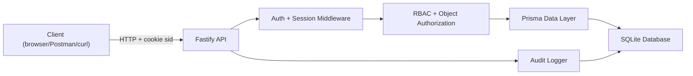

# Architecture and Security Mapping

## High-level flow

## Key modules

- `src/app.ts`: app assembly and global hardening middleware.
- `src/auth/sessionPlugin.ts`: signed cookie parsing and session user hydration.
- `src/auth/guards.ts`: authentication and role guards.
- `src/routes/auth.ts`: register/login/logout/password flows.
- `src/routes/documents.ts`: owner-or-admin document authorization.
- `src/routes/admin.ts`: admin-only user management.
- `src/routes/audit.ts`: privileged audit log read access.
- `src/lib/audit.ts`: centralized sensitive action event writer.

## Security control map

| Requirement | Mechanism | Primary location |
|---|---|---|
| Authentication | Password verification + server-side sessions | `src/routes/auth.ts` |
| Session security | Signed, httpOnly cookie + DB session expiry and revocation | `src/auth/sessionPlugin.ts`, `src/routes/auth.ts` |
| Authorization | RBAC checks and object ownership checks | `src/auth/guards.ts`, `src/routes/documents.ts` |
| Server-side validation | Zod schema validation on mutating endpoints | `src/routes/auth.ts`, `src/routes/documents.ts`, `src/routes/admin.ts` |
| Rate limiting | Global limiter + stricter auth route limiter + login throttle | `src/app.ts`, `src/routes/auth.ts` |
| Secret handling | `.env` + `.env.example`, no committed runtime secrets | `.env.example`, `README.md` |
| Sensitive action logging | AuditEvent rows for auth/admin/document operations | `src/lib/audit.ts`, route handlers |

## Current known limitations

- No MFA yet.
- No account lockout or captcha flow yet.
- SQLite is fine for demo/single-node, but not ideal for high concurrency production.
