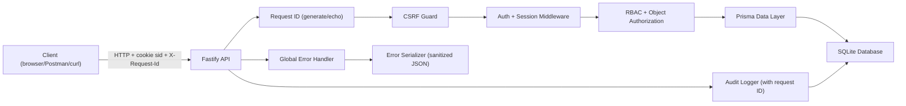

# Architecture and Security Mapping

## High-level flow

## Key modules

- `src/app.ts`: app assembly, global hardening middleware, error handler and request ID registration.
- `src/auth/sessionPlugin.ts`: signed cookie parsing and session user hydration.
- `src/auth/guards.ts`: authentication and role guards (throws `AuthenticationError` / `AuthorizationError`).
- `src/auth/csrfGuard.ts`: per-session CSRF token validation on state-changing methods.
- `src/routes/auth.ts`: register/login/logout/password flows with account lockout.
- `src/routes/documents.ts`: owner-or-admin document authorization.
- `src/routes/admin.ts`: admin-only user management (role assignment/revocation, account unlock).
- `src/routes/audit.ts`: privileged audit log read access.
- `src/lib/audit.ts`: centralized sensitive action event writer (includes request ID in metadata).
- `src/lib/csrf.ts`: CSRF token generation (32-byte random) and constant-time comparison.
- `src/lib/requestId.ts`: `X-Request-Id` header generation and echo.
- `src/lib/sessionRotation.ts`: session rotation on privilege changes (password, role, unlock).
- `src/lib/sessionToken.ts`: SHA-256 session token hashing.
- `src/errors/AppError.ts`: base error class with HTTP status, error code, and optional details.
- `src/errors/errorCodes.ts`: machine-readable error code constants.
- `src/errors/authErrors.ts`: `ValidationError`, `AuthenticationError`, `AuthorizationError`.
- `src/errors/resourceErrors.ts`: `NotFoundError`, `ConflictError`, `RateLimitError`, `AccountLockedError`.
- `src/errors/errorSerializer.ts`: serializes errors into consistent JSON response shape.
- `src/errors/errorHandler.ts`: global Fastify error handler (catches all thrown errors).
- `src/errors/errorLogger.ts`: error logging with sensitive field sanitization.
- `src/errors/zodError.ts`: Zod validation → `ValidationError` conversion.

## Security control map

| Requirement | Mechanism | Primary location |
|---|---|---|
| Authentication | Password verification + server-side sessions | `src/routes/auth.ts` |
| Session security | Signed, httpOnly cookie + DB session expiry and revocation + SHA-256 token hashing | `src/auth/sessionPlugin.ts`, `src/lib/sessionToken.ts` |
| Session rotation | New session token on password change, role assignment/revocation, unlock | `src/lib/sessionRotation.ts` |
| Authorization | RBAC checks and object ownership checks | `src/auth/guards.ts`, `src/routes/documents.ts` |
| CSRF protection | Per-session synchronizer token validated on state-changing methods | `src/auth/csrfGuard.ts`, `src/lib/csrf.ts` |
| Account lockout | Lock after 5 failed logins for 15 min, admin unlock | `src/routes/auth.ts`, `src/routes/admin.ts` |
| Server-side validation | Zod schema validation on mutating endpoints | `src/routes/auth.ts`, `src/routes/documents.ts`, `src/routes/admin.ts` |
| Rate limiting | Global limiter + stricter auth route limiter + per-route limits | `src/app.ts`, `src/routes/auth.ts` |
| Structured errors | Consistent JSON error shape with machine-readable codes, no internal leakage | `src/errors/` |
| Request tracing | `X-Request-Id` on every response, included in error responses and audit logs | `src/lib/requestId.ts` |
| Error logging | Sensitive fields redacted (passwords, tokens, secrets) | `src/errors/errorLogger.ts` |
| Secret handling | `.env` + `.env.example`, no committed runtime secrets | `.env.example`, `README.md` |
| Sensitive action logging | AuditEvent rows for auth/admin/document/session operations | `src/lib/audit.ts`, route handlers |

## Current known limitations

- No MFA yet.
- SQLite is fine for demo/single-node, but not ideal for high concurrency production.
- No cursor-based pagination on audit events or document listings.
- No OpenAPI/Swagger documentation auto-generation.
- No graceful shutdown handling (`SIGTERM`/`SIGINT`).
